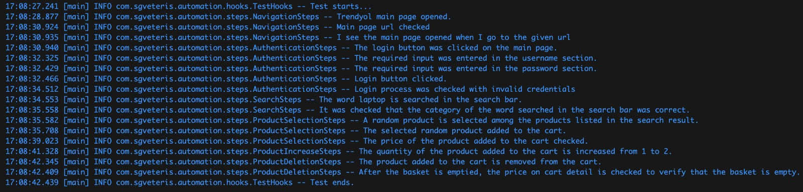

# SGVeteris - Automation Project

This project is a versatile UI test automation project designed to perform various tests on a website (specifically, Trendyol) based on user-defined parameters. The project leverages Selenium for test automation and Log4j for monitoring and logging. It provides a robust framework for testing the website's functionalities and ensuring the correctness of the outputs against the given parameters.

### Prerequisites
Make sure you have the following software installed before running the tests:

- Java 11
- Maven
- WebDriver
- Other dependencies listed in the `pom.xml` file.
## Installing

After downloading the dependencies in the pom.xml file, the test is executed from the CucumberTestRunner.java class.
## Project Structure

[Project structure](src/resources/images/project_structure.jpeg "GitHub")

In the project, I have utilized the structure you see below;

**resources:** It is the folder that hcontains the logback.xml file created for log4j configuration.

**Hooks:** It is the folder where the TestHooks class is located.
- **TestHooks:** This class is used for starting and terminating drivers.

**Steps:** All pages used in the test cases are represented through classes within it. Each class contains the operations performed in relation to a specific test case.

- **AuthenticationSteps:**  It is the class where user login operations are performed. As specified in the test case, user login with invalid credentials is performed through this class.

- **NavigationSteps:** It is the class that verifies the opening of the main page. When the relevant URL is entered, it is checked on this page whether the main page has been opened or not.

- **ProductDeletionSteps:** It is the class where the process of removing an item added to the cart is performed. Operations such as deleting a product from the cart and verifying that the product has been successfully removed are carried out within this class.

- **ProductIncreaseSteps:** It is the class where the process of increasing the quantity of a product is performed on the cart details page. Operations such as increasing the quantity of the product and verifying that the quantity has indeed increased are carried out within this class.

- **ProductSelectionSteps:** It is the class that performs the process of selecting a random product on the page and adding the selected product to the cart. Operations such as selecting a random product on the page, adding the selected random product to the cart, and verifying that the price remains the same as before adding it to the cart are carried out within this class.

- **SearchSteps:** It is the class where the product search process is performed. Operations such as entering a product in the search box, searching for the entered product, and verifying that the correct category related to the searched product is displayed are carried out within this class.

**CucumberTestRunner:** It is the class that contains the function responsible for running the test.

**resouces/features:** It is the folder containing the features that containes the test cases.

- *01_mainPage.feature:* It is the feature file where the test case is written to execute the operations in the NavigationSteps class.

- *02_login.feature:* It is the feature file where the test case is written to execute the operations in the AuthenticationSteps class.

- *03_category.feature:* It is the feature file where the test case is written to execute the operations in the SearchSteps class.

- *04_addToCart.feature:* It is the feature file where the test case is written to execute the operations in the ProductSelectionSteps class.

- *05_increaseItem.feature:* It is the feature file where the test case is written to execute the operations in the ProductIncreaseSteps class.

- *06_deleteAndCheckCart.feature:* It is the feature file where the test case is written to execute the operations in the ProductDeletionSteps class.

**pom.xml:** It is an xml file that comes with a Maven project. It is a structure where we define the frameworks to be used in the project.

 

## Sample Screenshots

An example output of the log structure.

  
## Used Technologies
- Java 11
- Maven
- JUnit5
- Log4J

## Contributing
If you would like to contribute to this project, please open an issue or submit a pull request.